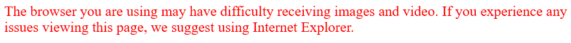

# 930L
Everything about the D-Link DCS-930/930L

## Intro

## Why?

I have more of these cameras than I should and would hate for them to go directly into the trash.

The DCS-930 and 930L still function, but outdated firmware and a lack of software support dooms these devices to the landfill. Here are just a few of the problems this device has:

 - The web interface has a browser whitelist. Anything modern will be blocked, requiring the use of Safari or Internet Explorer (pre-Windows 8)

 - The "Live Video" feed, once signed in, offers an ActiveX Control viewer or a Java Web Applet viewer. Silverlight and its friends have been long dead for over a decade.

 - The web interface and myDLink mobile app have completely different functions (eg. web has email notifications, mobile has push notifications), forcing you to use both to get full usage of the camera. The app is similarly outdated, receiving only Android API Level upgrades on occasion.

 - Setting up the mobile app, the only way to access these cameras without tricks, requires a Chrome extension install and constant fighting with D-Link's slew of broken and old websites. 

 - A few people still have these cameras exposed to the world. With outdated firmware, there are likely many, many vulnerabilities waiting to be exploited.

 - Many of the camera's API routes and URLs are undocumented. Third-party websites have found a few paths, but they each have different bits and pieces of information. A centralized place would be wonderful

 - There seems to have been a project decrypting and reverse engineering the firmware. I would love to be skilled in that, so familiarizing myself with the device is a start.


This repo aims to return some usability to these cameras, reimplement the web portal, document interesting things about the cameras, and, eventually, add features so these cameras can serve as an incredibly cheap option for hobby projects.


## Accessing the Web Interface


The web interface is accessed using HTTP. Toss `http://[camera.IPv4.address]` into a browser and then sign in with HTTP basic auth. 

Attempting to access it from a headless client without an authorization header will fail with a 401 error. Attempting to access it from a modern browser (ig. not IE or Safari) will return this page instead:



 I've gotten **so** tired of spinning up the Windows XP VM when I need to change the settings for the 930.

In order to ease access, use the `Mozilla/4.0 (compatible; MSIE 8.0; Windows NT 6.1; Trident/4.0)` user agent with your browser's development tools to access it on a modern Chromium-based browser.

# Authorization

When using this User Agent, Chromium sends a request roughly equivalent to this:

```PowerShell
$session = New-Object Microsoft.PowerShell.Commands.WebRequestSession
$session.UserAgent = "Mozilla/4.0 (compatible; MSIE 8.0; Windows NT 6.1; Trident/4.0)"
Invoke-WebRequest -UseBasicParsing -Uri "" `
-WebSession $session `
-Headers @{
"Accept"="text/html,application/xhtml+xml,application/xml;q=0.9,image/avif,image/webp,image/apng,*/*;q=0.8,application/signed-exchange;v=b3;q=0.7"
  "Accept-Encoding"="gzip, deflate"
  "Accept-Language"="en-US,en;q=0.9"
  "Authorization"="Digest username=`"`", realm=`"`", nonce=`"`", uri=`"/`", response=`"`", qop=auth, nc=, cnonce=`"`""
  "DNT"="1"
  "Upgrade-Insecure-Requests"="1"
}
```

Only the authorization header is required to get 200.