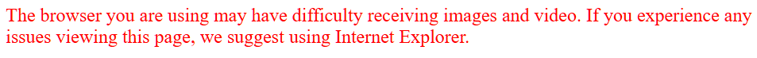

# Authentication and Authorization

## Accessing the Web Interface


Attempting to access it from a modern browser (ig. not IE or Safari) will return this wonderful page:



 The camera checks for Firefox, Safari, and Internet Explorer, but specific versions of each. I've gotten **so** tired of spinning up the Windows XP VM when I need to change the settings for the 930. Use `Mozilla/4.0 (compatible; MSIE 8.0; Windows NT 6.1; Trident/4.0)` or a similar IE 6-9 user agent to access it on a modern browser.

Chrome's devtools can output the request sent to the camera as a PowerShell script:

```PowerShell
$session = New-Object Microsoft.PowerShell.Commands.WebRequestSession
$session.UserAgent = "Mozilla/4.0 (compatible; MSIE 8.0; Windows NT 6.1; Trident/4.0)"
Invoke-WebRequest -UseBasicParsing -Uri "" `
-WebSession $session `
-Headers @{
"Accept"="text/html,application/xhtml+xml,application/xml;q=0.9,image/avif,image/webp,image/apng,*/*;q=0.8,application/signed-exchange;v=b3;q=0.7"
  "Accept-Encoding"="gzip, deflate"
  "Accept-Language"="en-US,en;q=0.9"
  "Authorization"="Digest username=`"`", realm=`"`", nonce=`"`", uri=`"/`", response=`"`", qop=auth, nc=, cnonce=`"`""
  "DNT"="1"
  "Upgrade-Insecure-Requests"="1"
}
```

Only the authorization header is required to get 200, so this can be slimmed down:

```PowerShell
$session = New-Object Microsoft.PowerShell.Commands.WebRequestSession
$session.UserAgent = "Mozilla/4.0 (compatible; MSIE 8.0; Windows NT 6.1; Trident/4.0)"
iwr <camera-ip-addr> -WebSession $session -Headers @{"Authorization"="Digest username=`"`", realm=`"`", nonce=`"`", uri=`"/`", response=`"`", qop=, nc=, cnonce=`"`""}
```

After [researching HTTP Digest auth](https://datatracker.ietf.org/doc/html/rfc2617#section-3), I found where these missing values that Chrome sends come from. The realm, qop, and nonce can be retrieved from the WWW-Authenticate header of the Unauthorized response with the following snippet:

```Powershell
try{iwr <camera-ip-addr>} catch [System.Net.WebException] {echo $_.Exception.Response.Headers["WWW-Authenticate"]} 
```